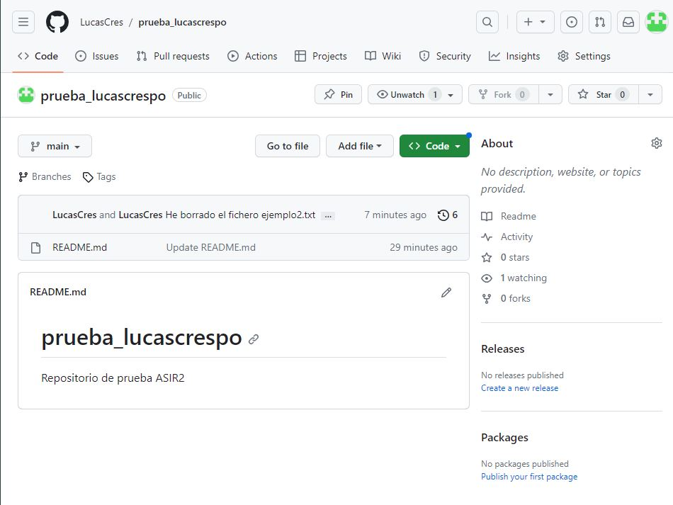
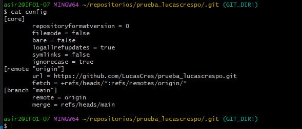
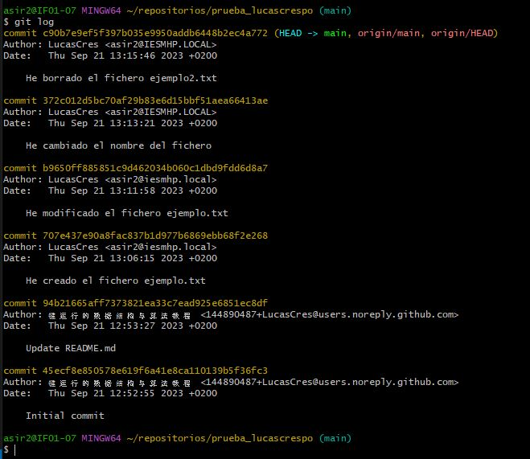
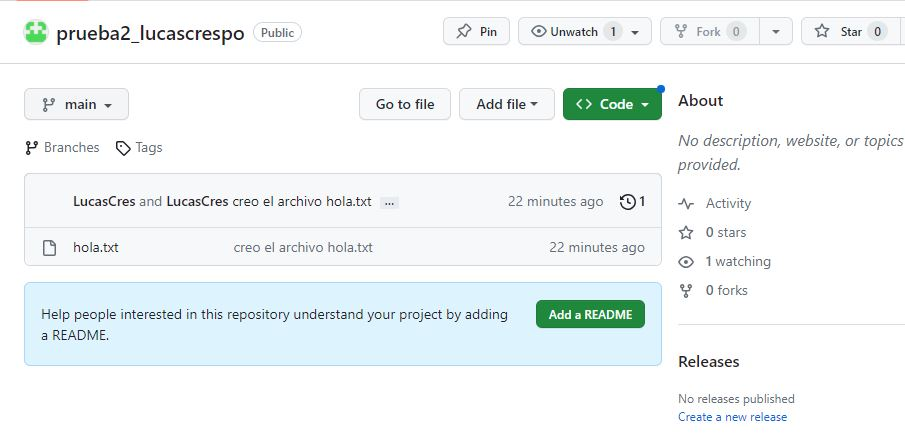
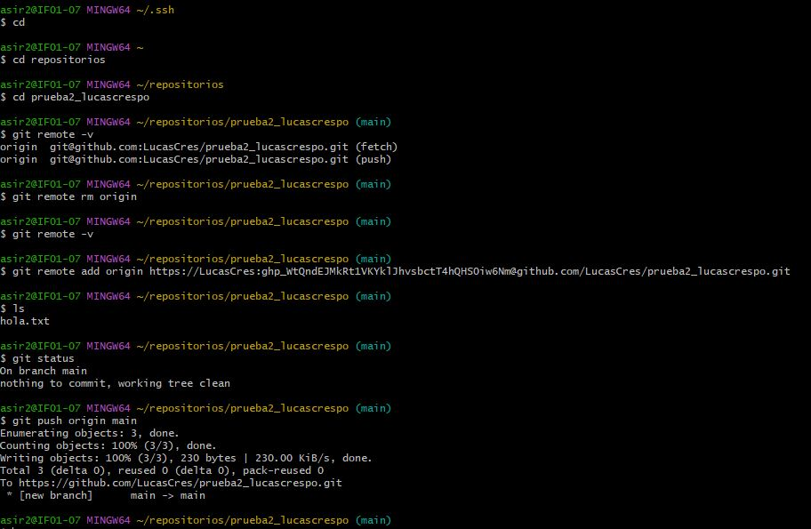

# Taller 1

### 1. Una captura de pantalla donde se vea que has creado correctamente el repositorio.

### 2. El contenido del fichero `.git/config` para que se vea que has clonado el repositorio con la URL ssh (o la URL https si te has conectado por token).

### 3. La salida de la instrucción git log para ver los commits que has realizado (debe aparecer como autor tu nombre completo).

### 4. Buscar información para crear un nuevo repositorio llamado prueba2_tu_nombre. En esta ocasión, crea primero el repositorio local (usando git init) y luego busca información para sincronizarlo y crear el repositorio remoto en GitHub. Comenta los pasos que has realizado y manda alguna prueba de funcionamiento.

---
Primero crear el repositorio    
`mkdir prueba2_lucascrespo`    
___
Segundo ejecutar estando dentro del repositorio el comando  
`git init`
___
Luego crear un archivo cualquiera dentro del repositorio como por ejemplo hola.txt  
`touch hola.txt`  
`git add .  `  
`git commit -m "He creado el archivo hola.txt"`  
___
Para finalizar se crea un repositorio vacion en github con el mismo nombre

___
Y se enlaza el local con el remoto

